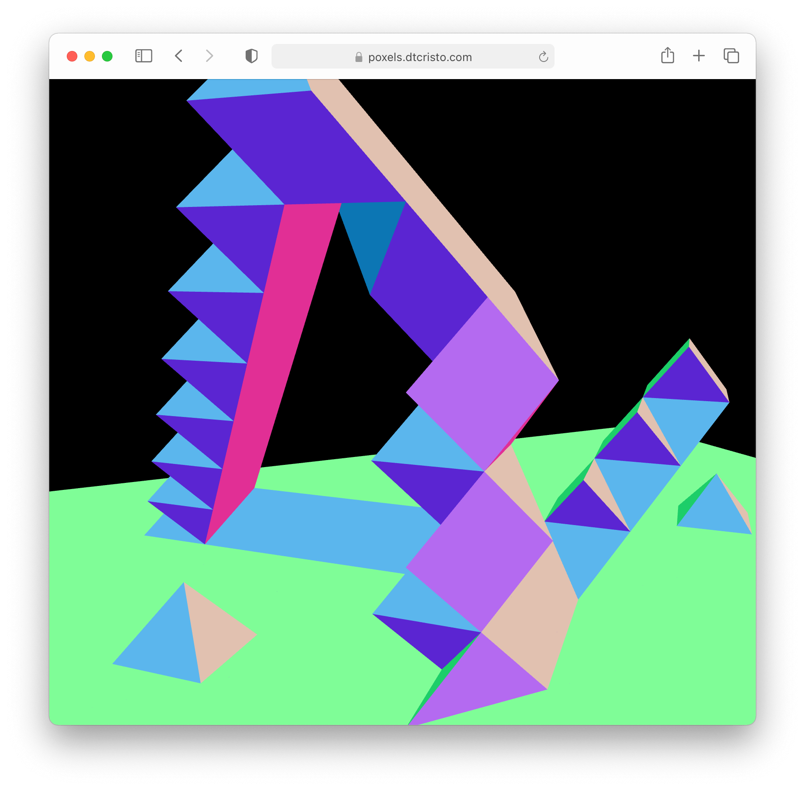

<div align="center">
  <h1>poxels</h1>
  <p>
    <strong>Interactive polygon builder</strong>
  </p>
  <a href="https://poxels.dtcristo.com/">
    
  </a>
</div>

## Controls

- Left click places a poxel.
- Right click deletes a poxel.

## How to install

Installs project dependences. See `script/setup` for details.

```sh
script/setup
```

## How to run in debug mode

Builds the project. View in browser at [localhost:10001](http://localhost:10001/). Auto-reloads when the project changes.

```sh
script/start
```

## How to build in release mode

Builds the project and places it into the `dist` folder.

```sh
script/build
```

## License

Licensed under either of

- Apache License, Version 2.0
  ([LICENSE-APACHE](LICENSE-APACHE) or http://www.apache.org/licenses/LICENSE-2.0)
- MIT license
  ([LICENSE-MIT](LICENSE-MIT) or http://opensource.org/licenses/MIT)

at your option.

## Contribution

Unless you explicitly state otherwise, any contribution intentionally submitted
for inclusion in the work by you, as defined in the Apache-2.0 license, shall be
dual licensed as above, without any additional terms or conditions.
